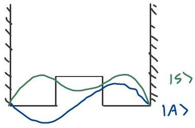

If $[H, \pi]=0$, and $|n\rangle$ non-degensate $H$ e.jerstate, then $|n\rangle$ is party ergenstate.
ex) SHO
$a^{+} \sim \tilde{x}-i \hat{p}$ so party odd, $\Pi a^{+} \Pi=-a^{+}$
Then

$$
\Pi a^{+}|0\rangle=-|1\rangle
$$

Ingencoal,

$$
\Pi|n\rangle=(-1)^{n}|n\rangle
$$

Hydrogen
g.s. $\ln |x\rangle=|1,00\rangle$
$\langle\vec{x} \mid 100\rangle=R_{1.0}(6) y_{0}^{0}(\theta, 4)=\left(\frac{z}{a_{0}}\right)^{3 / 2} e^{-2 \%} \frac{1}{\sqrt{4 \pi}}$, party even
$1^{\text {st }}$ excited: $\left|n A_{m}\right|=|200\rangle$ (degreesate $\left.m 1, m_{1}\right)$
Superpostion: $|\psi\rangle: C_{p}|n=2, l=1\rangle+C_{s}|n=2, l=0\rangle$, not party ergensinte.
Selecton mles:
Two states $|\alpha\rangle,|\beta\rangle$ with $\Pi|\alpha\rangle=\varepsilon_{\alpha}|\alpha\rangle, \Pi|\beta\rangle=\varepsilon_{\beta}|\beta\rangle$
Dipole transition, $\alpha$ to $\beta$ :

$$
\begin{aligned}
\langle\beta| x|\alpha\rangle & =\langle\beta| \Pi\left(\Pi^{+} x \Pi\right) \Pi^{+}|\alpha\rangle \\
& =\left(\beta\left|\varepsilon_{\beta}(-x) \varepsilon_{\alpha}\right| \alpha\right\rangle \\
& =-\varepsilon_{\alpha} \varepsilon_{\beta}\langle\beta| x|\alpha\rangle
\end{aligned}
$$

$\Rightarrow \varepsilon_{\alpha} \varepsilon_{\beta}=-1$, must have opposite party
Mann's rule:
Transtion $\left\langle\psi_{f}\right| v\left|\psi_{i}\right\rangle, i(f)$ has party $\varepsilon_{i}\left(\varepsilon_{f}\right), v$ has porty $\varepsilon_{v}$
Requires: $\varepsilon_{f}=\varepsilon_{0} \varepsilon_{i} \Leftrightarrow \varepsilon_{f} \varepsilon_{0} \varepsilon_{i}=+1$.
ex) Double wed
Lett-right states:

$$
\begin{aligned}
& |L\rangle=\frac{1}{\sqrt{2}}(|S\rangle+|A\rangle) \\
& |R\rangle=\frac{1}{\sqrt{2}}(|S\rangle-|A\rangle)
\end{aligned}
$$

Non-statronary, oscrillate between $L, R$ with free.

$$
\omega=\frac{\epsilon_{a}-E_{s}}{\hbar}
$$

